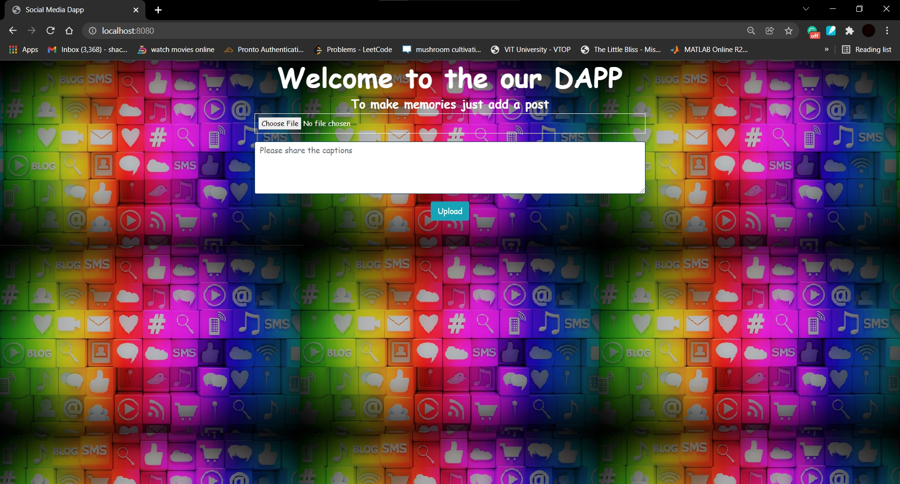
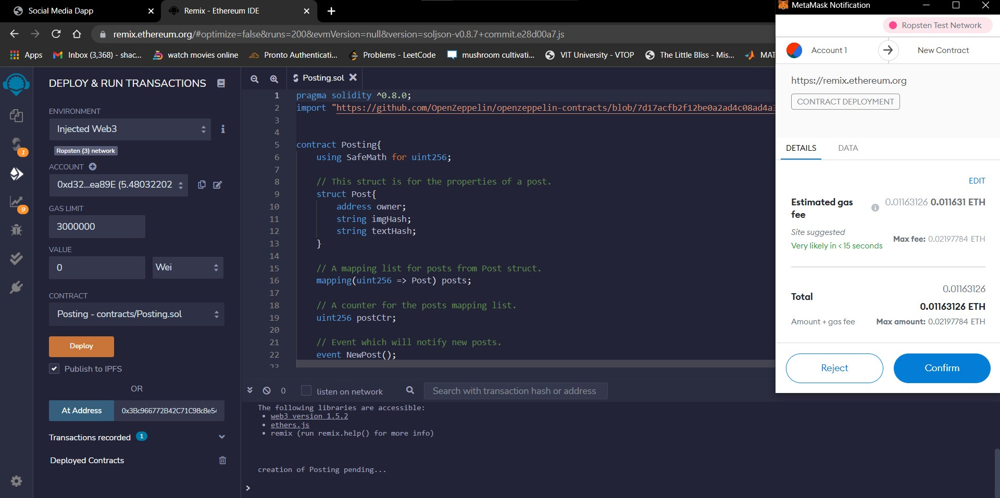
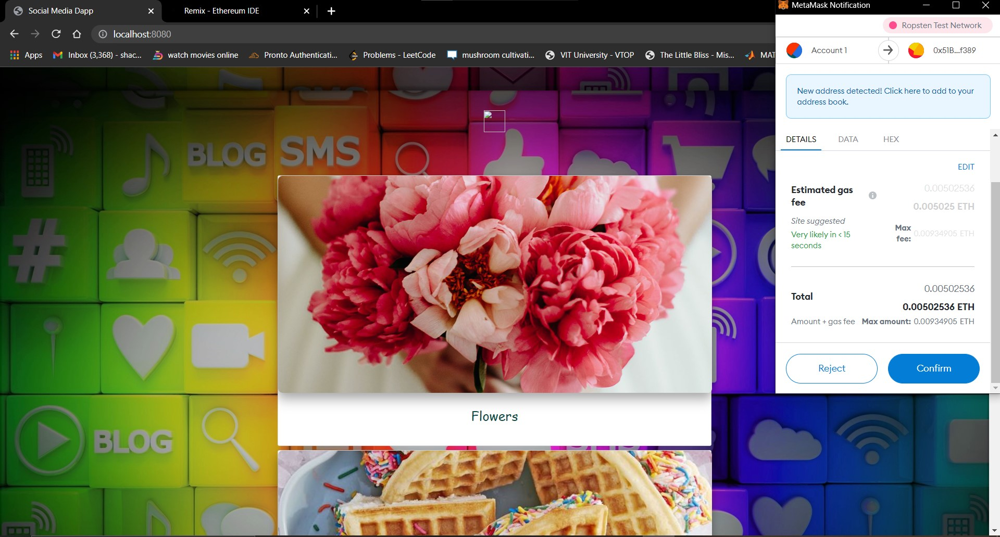
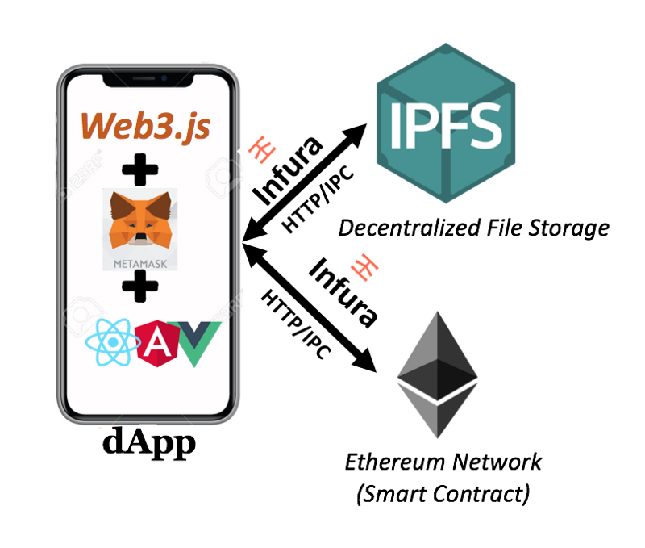
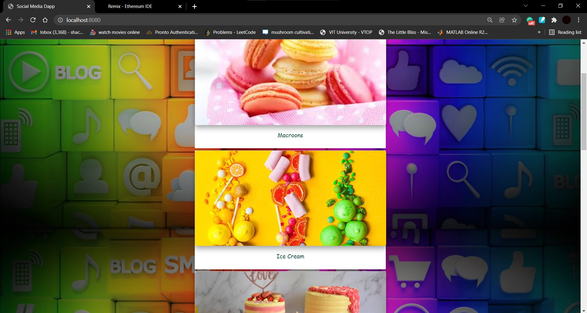

# Social Media Dapp

## **Abtract**
- Blockchain has been used in various fields nowadays, one of which is being implemented in this Cryptocurrency based application that gives a view of a social media platform where users can post images and give its description. 
- The application is based on InterPlanetary File System(IPFS) and Ethereum Blockchain with Vue.js frontend.
- The blockchain based social media app proposed here allows you to share content in a decentralised environment giving you a meaningful control over privacy and value for content being shared.
- Also , this blockchain technology being tamper evident makes your content unmodifiable and thus preventing the spread of modified and twisted stories. 

## **Architecture**
- **InterPlanetary File System** (IPFS) that is a protocol and peer-to-peer network for storing and sharing data using content addressing to uniquely identify each file in a global namespace connecting all the computing devices. 
- **Ethereum Blockchain** that helps to run the smart contract in the backend and even for data storage and it also provides Ether to run the contract and post images.
- **Metamask**  is a software cryptocurrency wallet used to interact with the Ethereum blockchain. It allows users to access their Ethereum wallet through a browser extension or mobile app, which can then be used to interact with decentralized applications.
- **Remix IDE** is an open source web and desktop application that fosters a fast development cycle and rich plugins for deploying smart contracts .
- **Vue.js** which is progressive JavaScript framework that helps to build the frontend web interfaces and one page application.
- **Web3.js** is used to interact with local or remote etherum nodes using HTTP, IPC or WebSocket.

## **Setup**
- Clone this repository
- Run "npm install"
- Deploy your smart contract (Posting.sol) on **Remix IDE** .
- Paste the ABI and address from your deployed contract to **contractInstance.js**
- Run "npm run dev"
- Connect to your deployed smart contract on **Remix IDE** to your **Metamask** by changing the envirnoment in **deploy & run trancsactions** to **Injected Web3**.
- You can now run your DAPP on "http://localhost:8080/" and upload the images , write caption and even see the previous uploaded posts.

## **Screenshots**
### Landing Page

### Remix IDE Contract

### Metamask Connection

### DAPP explaination

### Posts

### References
https://medium.com/openberry/https-medium-com-creating-an-instagram-like-dapp-with-ipfs-cc4fac85cbfe

 

